# 🧠 NeuraTrack

### AI-Powered Learning & Productivity Tracker

NeuraTrack is a modern learning productivity platform designed to help students and self-learners **plan their learning, track focused study sessions, visualize progress, and stay consistent**.

It combines learning-path management, focus sessions, analytics, achievements, and an AI companion into one unified experience.

<p align="center">
  <strong>Plan • Focus • Track • Improve</strong>
</p>

---

## 🚀 Live Demo

🌐 **Frontend:** https://neuratrack-three.vercel.app/

⚡ **Backend API:** https://neuratrack-backend.fastapicloud.dev/

📦 **GitHub:** https://github.com/wajeeha-asad/NeuraTrack

---

## ✨ Features

### 📚 Learning Paths

Create and manage structured learning paths with:

* Custom learning goals
* Session tracking
* Progress calculation
* Completion tracking
* Learning statistics

### ⏱️ Focus Mode

Dedicated workspace for distraction-free learning.

* Pomodoro-style focus sessions
* Session duration tracking
* Start/stop session controls
* Automatic session history
* Learning-path based sessions

### 📊 Analytics

Visualize your learning activity and progress.

* Total learning time
* Completed sessions
* Learning-path progress
* Productivity statistics
* Historical focus activity
* Progress visualization

### 🏆 Achievements

Stay motivated with an achievement system based on your learning activity.

* Learning milestones
* Session achievements
* Progress-based rewards
* Animated achievement experience

### 🔥 Progress & Streaks

NeuraTrack helps maintain consistency through:

* Daily activity tracking
* Learning streaks
* Progress indicators
* Completion statistics

### 🤖 Nova AI Companion

NeuraTrack includes **Nova**, an AI companion designed to make the learning experience more interactive and personalized.

### 👤 Authentication & Profile

Secure account experience with:

* User registration
* Login
* Authentication tokens
* Protected routes
* Profile management
* Account settings

### 📱 Responsive Design

Designed to work across:

* Desktop
* Laptop
* Tablet
* Mobile

---

# 📸 Screenshots

## Dashboard

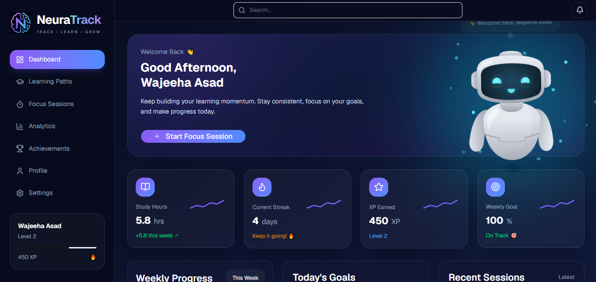

## Learning Paths

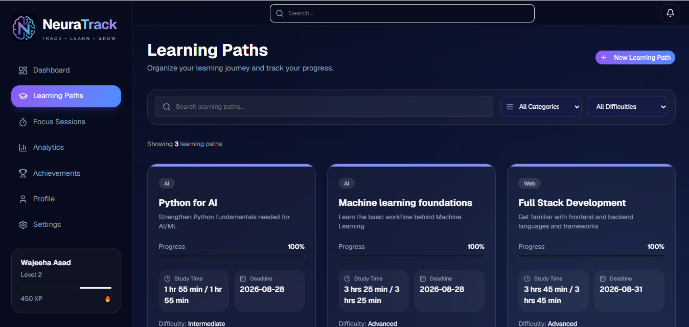

## Focus Mode

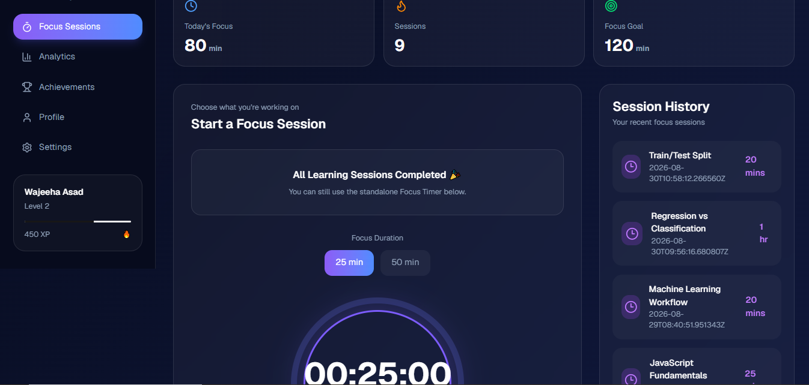

## Analytics

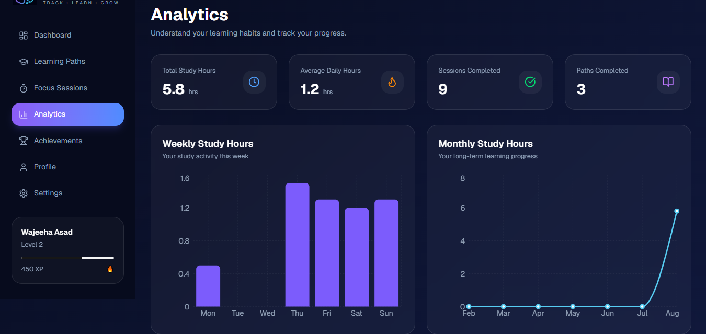

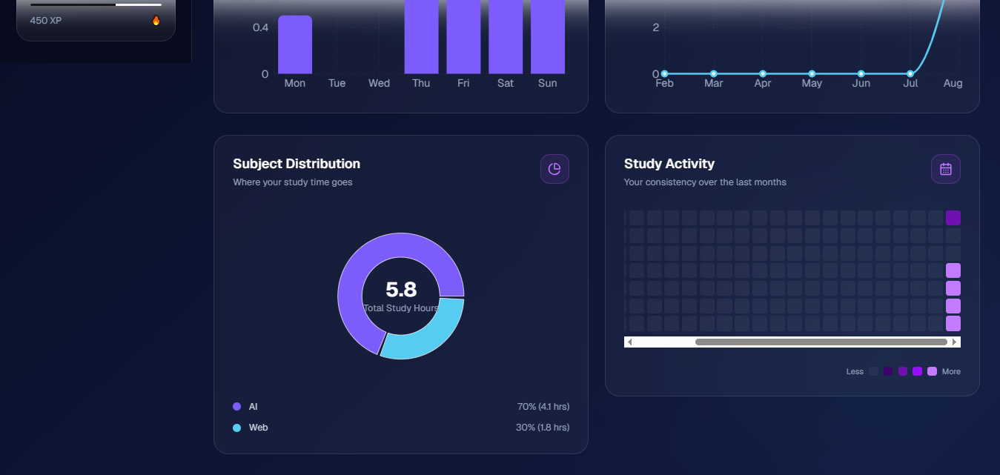

## Achievements

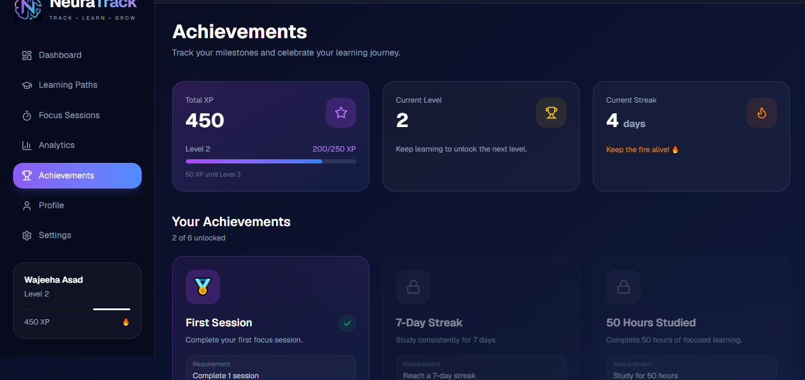

## Profile

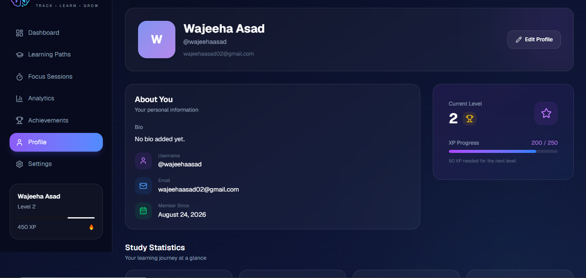

## Settings

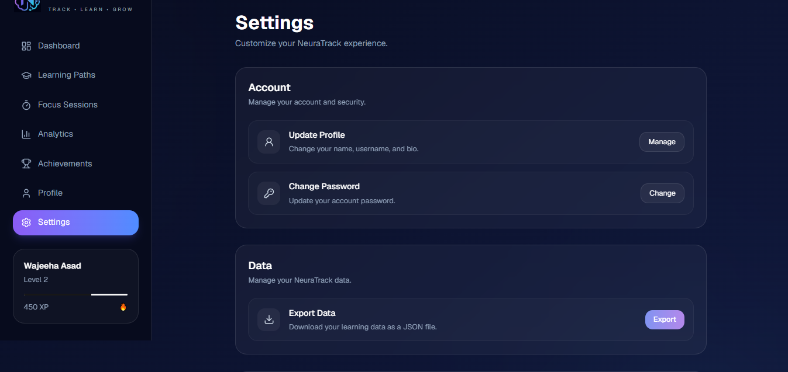

## Authentication

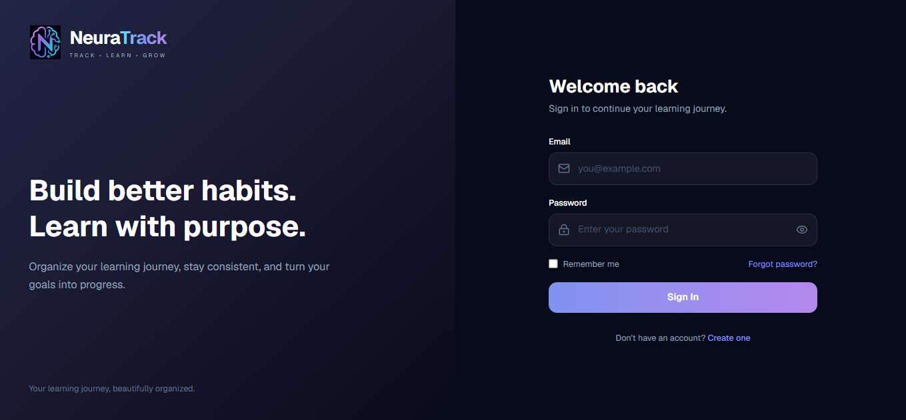

## Mobile Experience

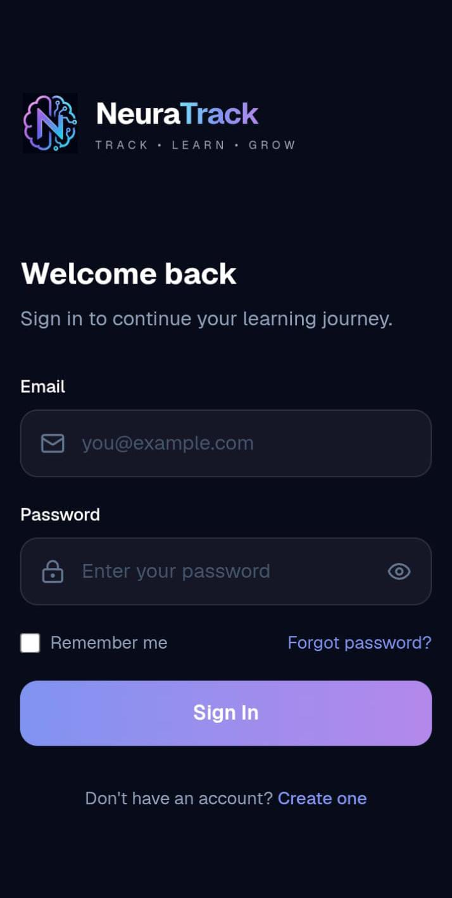

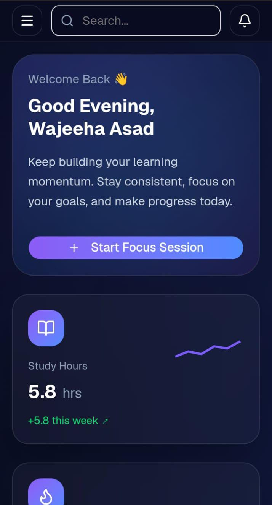

---

# 🏗️ Architecture

```text
                    ┌─────────────────────┐
                    │      NeuraTrack     │
                    │     Web Client      │
                    └──────────┬──────────┘
                               │
                               ▼
                    ┌─────────────────────┐
                    │    React Frontend   │
                    │ Vite + Tailwind CSS │
                    └──────────┬──────────┘
                               │
                         REST API
                               │
                               ▼
                    ┌─────────────────────┐
                    │    FastAPI Backend  │
                    │  Authentication     │
                    │  Business Logic     │
                    └──────────┬──────────┘
                               │
                               ▼
                    ┌─────────────────────┐
                    │  PostgreSQL /       │
                    │      Supabase       │
                    └─────────────────────┘
```

---

# 🛠️ Tech Stack

## Frontend

| Technology    | Purpose                 |
| ------------- | ----------------------- |
| React         | UI development          |
| Vite          | Frontend tooling        |
| Tailwind CSS  | Styling                 |
| shadcn/ui     | UI components           |
| Framer Motion | Animations              |
| Lucide React  | Icons                   |
| Chart.js      | Analytics visualization |
| Recharts      | Data visualization      |

## Backend

| Technology | Purpose             |
| ---------- | ------------------- |
| Python     | Backend development |
| FastAPI    | REST API            |
| SQLAlchemy | ORM                 |
| Pydantic   | Data validation     |
| JWT        | Authentication      |
| Argon2     | Password hashing    |
| Alembic    | Database migrations |
| Uvicorn    | ASGI server         |

## Database & Infrastructure

| Technology    | Purpose                 |
| ------------- | ----------------------- |
| PostgreSQL    | Relational database     |
| Supabase      | Database infrastructure |
| Vercel        | Frontend deployment     |
| FastAPI Cloud | Backend deployment      |
| GitHub        | Version control         |

---

# 📂 Project Structure

```text
NeuraTrack/
│
├── Backend/
│   ├── app/
│   │   ├── core/
│   │   ├── db/
│   │   ├── models/
│   │   ├── routers/
│   │   ├── schemas/
│   │   └── main.py
│   │
│   ├── alembic/
│   ├── pyproject.toml
│
```
